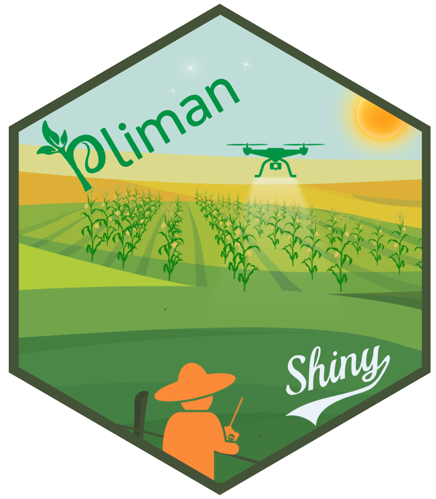

<!-- README.md is generated from README.Rmd. Please edit that file -->

# plimanshiny 

## Menu

<!-- badges: start -->

[](https://lifecycle.r-lib.org/articles/stages.html#experimental)
[](https://zenodo.org/doi/10.5281/zenodo.10476816)

<!-- badges: end -->

The goal of plimanshiny is to provide a Shiny interface for the pliman
package

## Installation

The development version of `plimanshiny` can be installed from
[GitHub](https://github.com/TiagoOlivoto/plimanshiny) using the
[pak](https://github.com/r-lib/pak) package:

``` r
install.packages("pak")
pak::pkg_install("TiagoOlivoto/plimanshiny")
```

*Note*: If you are a Windows user, you should also first download and
install the latest version of
[Rtools](https://cran.r-project.org/bin/windows/Rtools/).

## Overview

To start using plimanshiny, you need to load the package and call the
app with `run_app()`.

``` r
library(plimanshiny)
run_app()
```

The app will initiate and display the following home screen. It
comprises four primary modules for the analysis of orthomosaics.
Initially, you need to import the mosaic (1), then proceed to either
build or import the shapefile (2). Additionally, you have the option to
compute vegetation indexes (3), and ultimately, analyze the mosaics (4).


## Mosaics

Before importing the mosaic, several settings (1-3) can be configured.
Firstly, configure the mosaic bands (1). By default, the ‘BGR’ system
(bands 1, 2, and 3) is used, with Red-Edge and NIR bands assigned to
layers 4 and 5. You can also define the upper and lower quantiles for
color stretching configuration (3). Lastly, set the maximum number of
pixels to render in the map or plot. Choosing a larger value will result
in high-resolution leaflet plots, but the rendering time may
considerably increase. Utilizing the browse button (4), you can search
for and upload the mosaic file, with a maximum upload size of
approximately 2GB. There are three options for visualizing the mosaic:
‘rgb’ for an RGB plot, ‘mapview’ for an interactive map, or ‘bands’ to
plot individual layers (5). If the mosaic needs to be cropped to the
region of interest before analysis, you can switch it “on” (6). This
option allows users to crop the mosaic using the ‘Draw Rectangle’ tool
if necessary. Finally, you can save the mosaic (7).


After the mosaic has been uploaded, relevant informations are shown in a
pop-up.


## Shapefile

### Building a shapefile

The “shapefile” module can be utilized for both building and importing a
shapefile (1). When constructing a shapefile, users have the option to
configure the shape style, generating either a grid plot or a “free”
shape. To delineate the plot area, utilize the “Draw Polygon” tool. The
number of rows and columns can be specified, and a buffering factor (5)
is available. It’s important to note that negative values will remove
areas from the plot edge. Once the polygon is completed, the built plots
will be displayed. Click on “shapefile finished” (3) to conclude the
plot creation process.


After the plots have been created, you can edit them by toggling the
“Edit the drawn plots?” switch. In this step, you have the flexibility
to reshape, move, or delete individual plots. To finalize the editing
process, check the “Edition finished” box.


### Importing a shapefile

If a shapefile is already available, you can import it (1). It is also
possible to define a palette to color the plots if any variables are
available in the shapefile.


## Indexes

Calculating vegetation indices is straightforward. Users need to choose
either built-in indexes (1) or personalize their own (2). A list of
personalized indexes can be provided by separating each index with a
comma (“,”). It’s important to note that the index must be computed
considering the bands (R, G, B, RE, NIR) or the names of the mosaic’s
layers. Finally, users can select an index for synchronization with the
basemap (3).


## Analyze

The “Analyze” module works its magic. Users can first set the option to
define a summarization function for the extracted indexes (1), with the
mean being the default. Following that, options for plot or individual
segmentation are provided. If neither plots nor individuals are
segmented, the indexes (computed in the “Index” module) are extracted,
and the mean is computed for each shape (defined in the “Shapefile”
module).

When “Segment individuals” is selected (2), various options for defining
how the segmentation is performed become available. Firstly, users must
define an index to be used for segmentation (3), set a threshold value
(5), decide whether to invert the segmentation (7), and specify the
tolerance and extension arguments for watershed segmentation (9). For
additional details on this, refer to
[`analyze_objects()`](https://tiagoolivoto.github.io/pliman/reference/analyze_objects.html)
function. Objects with less than 15% of the overall mean area are
removed by default, a factor controlled by the “Lower noise” option
(11). To reduce noise, it’s also possible to apply median filtering to
the mask (12). When all is right, click “Analyze the mosaic!”


After the mosaic has been analyzed, you can view a summary of the
results at the plot and individual levels. Attributes for plots and
individuals can be selected to be plotted on the map (2).


Finally, the results can be exported to shapefiles (5) or sent to a
variable in the R environment (6).

- Results exported directly to the R environment
  
  
